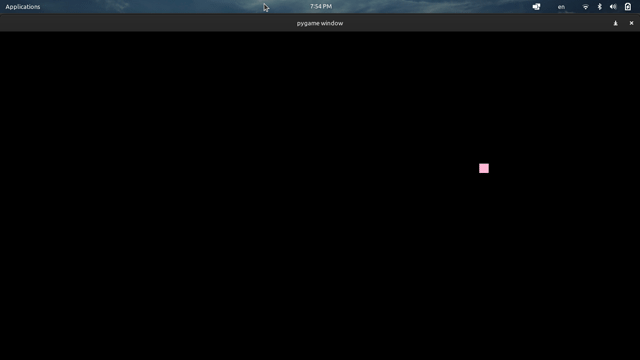

# Bouncing Ball
## goit-python-marathon-hw-01

This is GoIt Python Marathon homework 01. A simple Pygame program that demonstrates a bouncing ball animation.

## Task:
- make an object to bounce off a wall
- make an object change colors after each bounce

## Installation
To run the program, you must have Pygame installed. You can install it via pip:

`pip install pygame`

## Usage
Run the following command to start the program:

`python main.py`

The program will display a window with a bouncing ball animation. The ball changes color every time it bounces off a wall.

Press the 'Close' button in the window or Ctrl + C in the terminal to exit the program.
